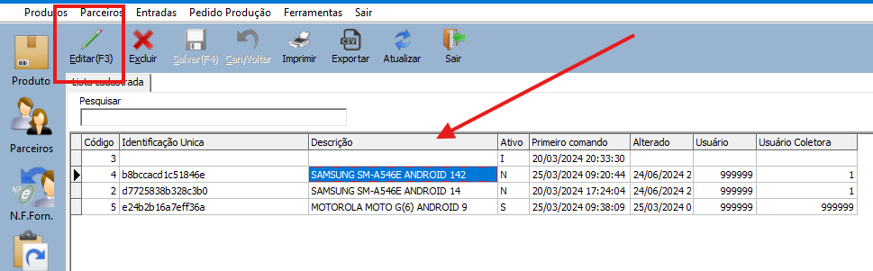
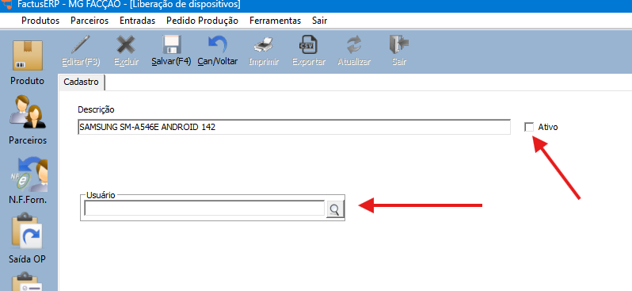
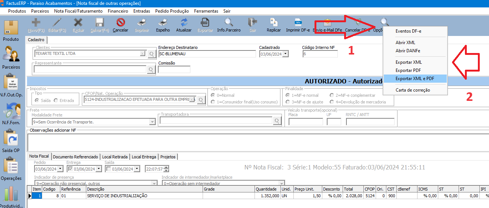

Manual emissão de notas de retorno de industrialização

Vai abrir a tela de pedido de saída.

Editar Pedido

Encerrar Pedido

1 – Após encerrar vai ativar o botão Gerar NF

2 – Escolha a opção desejada, neste exemplo Gerar nota de retorno de industrialização

Abra a nota fiscal gerada utilizando o menu ou atalha

1 Localize a nota fiscal

2 Editar a nota fiscal

Salvar editar itens para alterar os itens da nota

Caso precise alterar alguma quantidade devolvida

1 – Clique duas vezes do item a ser alterado,

2 – Informe a nova quantidade

3 – Salvar alteração

Caso precise enviar um item não industrializado

1 – Localize o produto

2 – Informe a quantidade

3 – Informe o preço do item

4 – Altera a CFOP para a de retorno

5 – Salve o Item.

Caso tenha mais item, repita as etapas anteriores.

6 – Editar Nota para encerrar o faturamento.

1 – Encerrar a nota fiscal

Ai vai abrir a tela das observações

1 – Observações na nota fiscal

2 – Próxima parte do faturamento

1 – Exclua os volumes calculados.

Botão Próximo para ir para próxima tela, repita essas opções.

1 – Próxima pagina

Tela final

1 – Prximo/encerrar

2 – Vai abrir a pergunta de confirmação, sim para gerar número de nota fiscal.

Sim para enviar para autorização

Após autorizado

1 – Opções DFe

2 – Abrir DANFe – para visualizar DANFE

2 – Exportar XML, Exportar PDF, ou Exportar XML  e PDF, para exportar os arquivos.