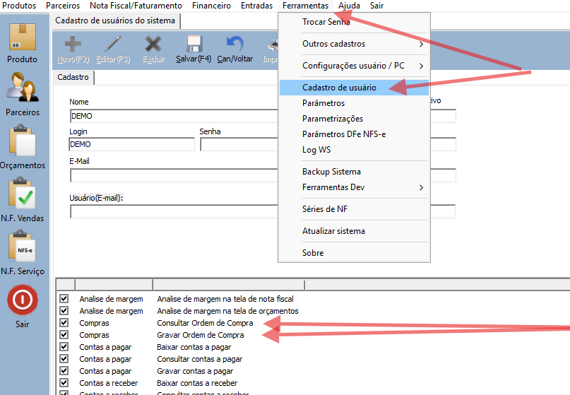
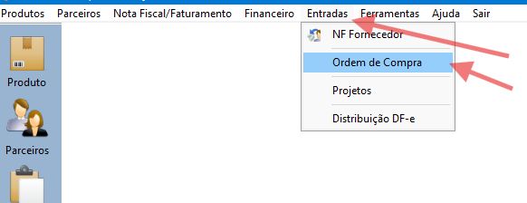
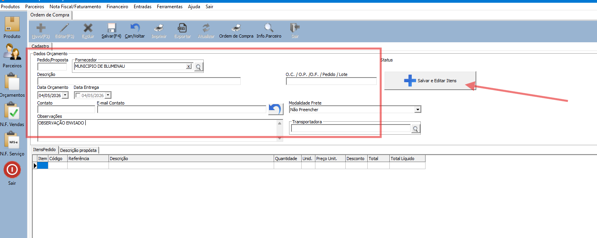
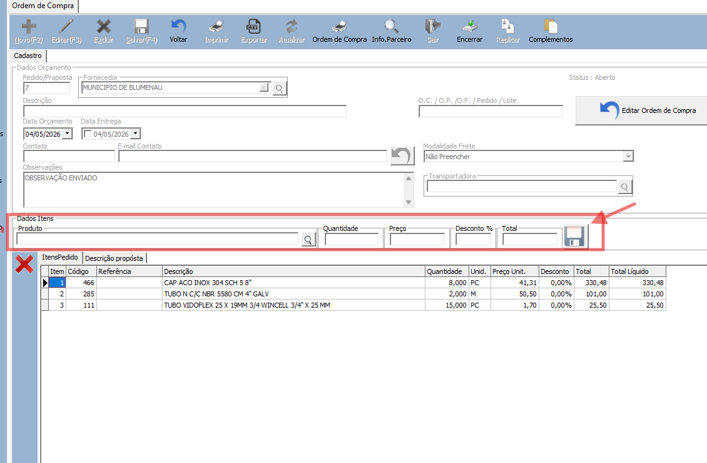
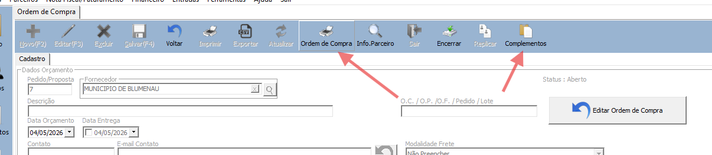
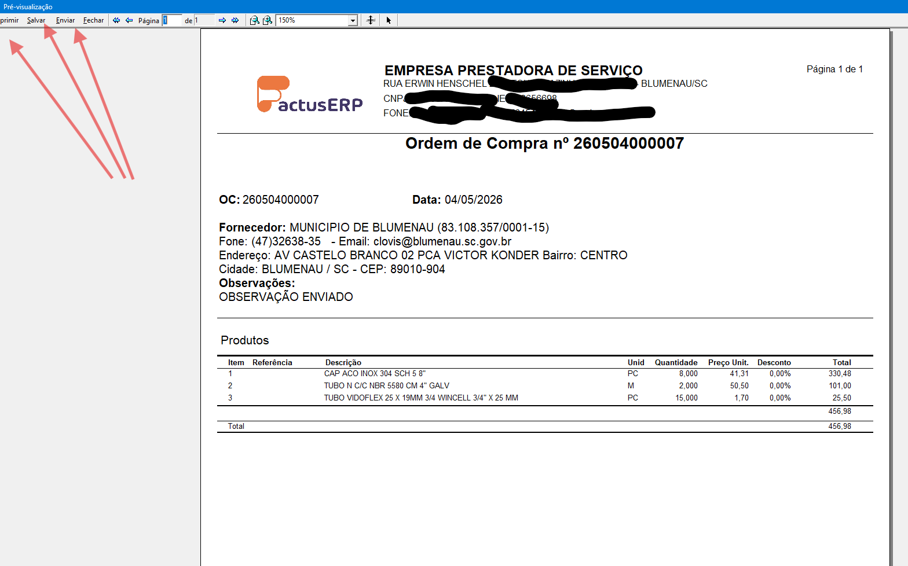
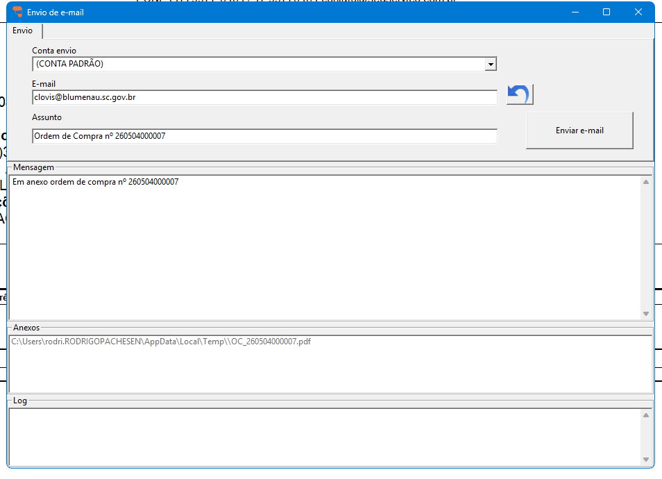
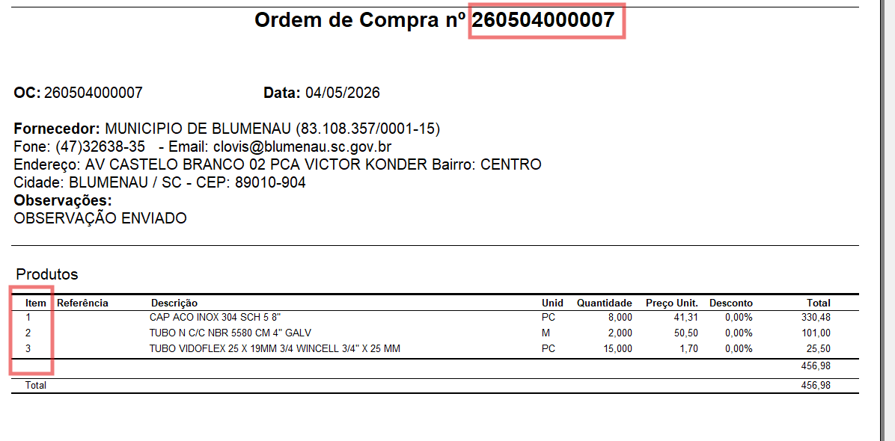
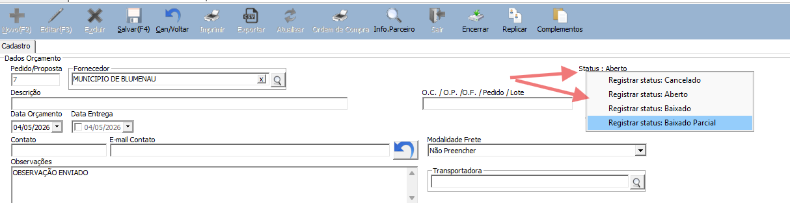

Ordem de compra

A ordem de compra é um documento formal emitido pela empresa compradora para um fornecedor, contendo as condições acordadas para aquisição de produtos ou serviços.

O cabeçalho reúne dados gerais da negociação e o fornecedor.
Os itens contêm produto/serviço, quantidade e preço acordado.

O Fluxo é: emitir e enviar ao fornecedor para formalizar o pedido.
No recebimento, é usada para conferir itens, quantidades e valores.
Permite controlar pendências, divergências e entregas parciais.

Abaixo explicação do funcionamento:

1 – Liberar acesso a ordem de compra.

2 – No menu Entradas → Ordem de compra. Tenha acesso a tela.

3 – Após abrir a tela e clicar em novo, preenche os dados que for necessário do quadro em vermelho e clique em “Salvar e editar itens” para incluir os itens da ordem de compra.

6 – Imprimir, Salvar ou Enviar Ordem de Compra para seu fornecedor.

8 – Baixa de ordem de compra.

Baixar por XML: Ao receber o XML e importar no menu, Entradas → NF Fornecedor. E no item do XML for enviado no xPed o número da Ordem de compra enviado pelo sistema e no nItemPed o número do item, será feita a baixa automática.

Ou pode ser utilizado o botão “Encerrar” para registrar como finalizada.