Como configurar o Aplicativo no Celular/Tablet

Execute a opção.

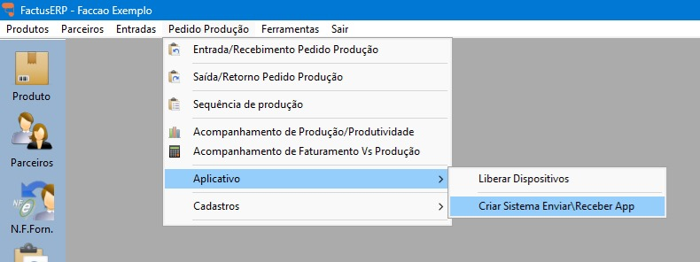

Será criado um atalho do sistema, quando reiniciar o sistema sempre vai abrir esse sistema.

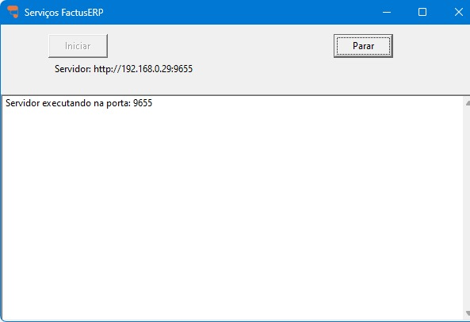

Esse aplicativo, vai ficar rodando no teu computador, se precisar reabrir ou encerrar o print abaixo mostra como fazer, próximo do relógio do computador.

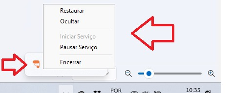

No celular ou tablet, precisa digitar o link abaixo para instalar o aplicativo

https://assessoriafutura.com.br/app/factusapp.apk

Autorize o download

Execute a opção Instalar

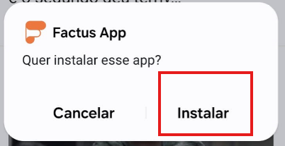

Dependendo do aparelho pode pedir autorizações a mais.

Após instalar, pode abrir ou localize o aplicativo no celular/tablet

Após abrir, será apresentado a tela inicial de configuração.

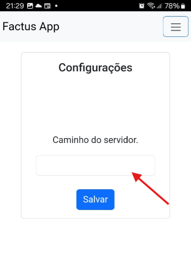

Informe no campo acima, o endereço apresentado no aplicativo que fica rodando próximo ao relógio do servidor.

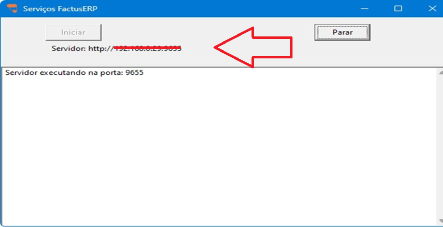

Se informado tudo certo. Será apresentado a mensagem abaixo:

No factus ERP, acesse:

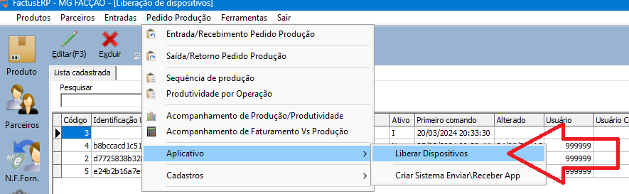

Localize o aplicativo pelo nome:

Ative e se for liberar somente para um grupo/usuário, informe no campo

Volte no aplicativo e será apresentado a tela abaixo

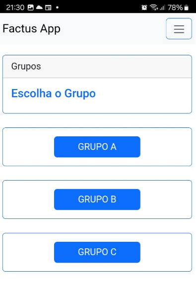

Clicando no grupo ou se já informado o usuário, vai abrir a próxima tela, com o artigo que está no primeiro item da produção:

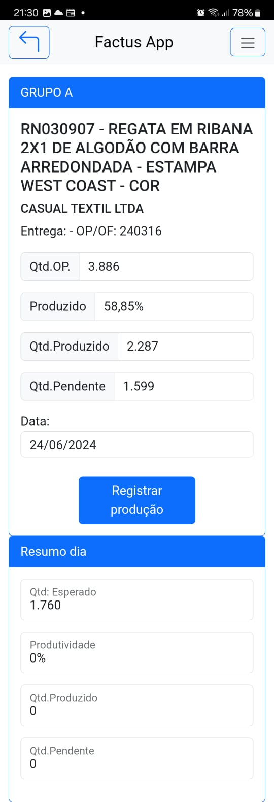

Clicando no registrar, vamos para tela:

Informe a quantidade e clique em “Gravar Apontamento”

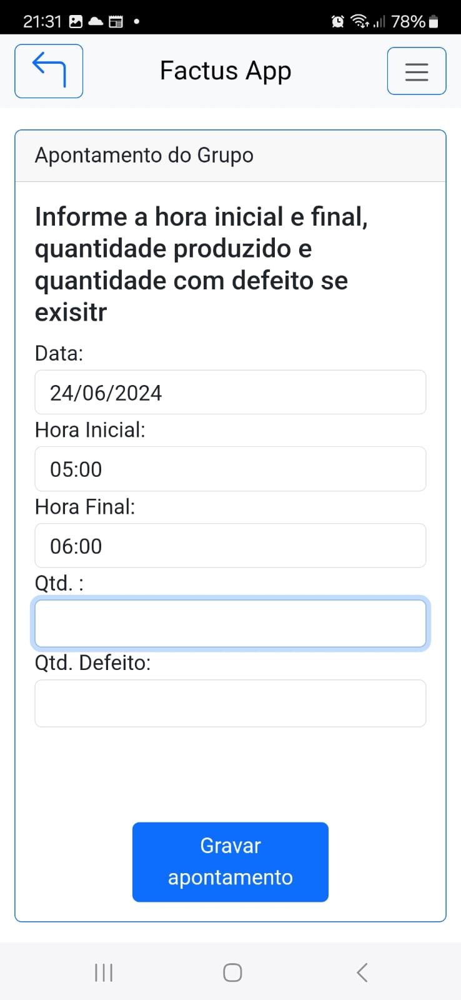

Ao gravar, vai voltar para tela anterior, já totalizando:

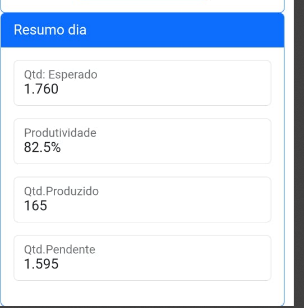

...

Caso queira voltar temos o botão acima a esquerda, ou no botão a direita temos o menu de opções

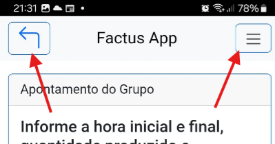