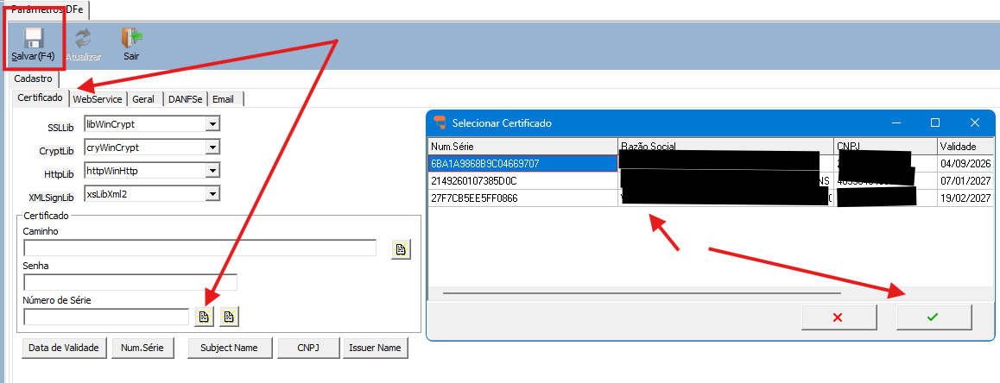
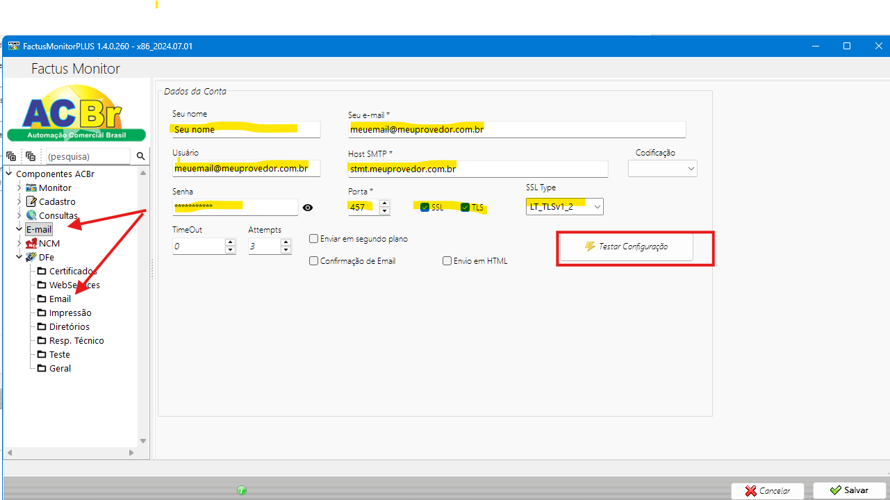
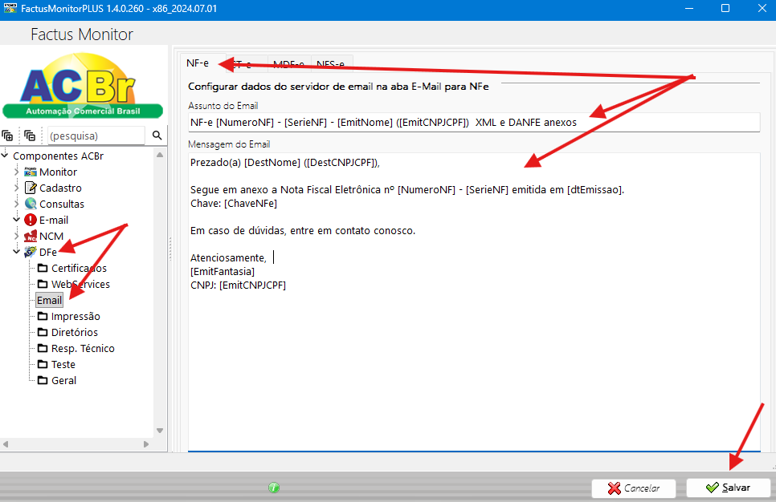

Configuração envio de e-mail na autorização da Nfe.

Confirme se esta ativado, e ative se estiver desmarcado e salve.

2 – Na mesma tela clique em “Configurações NF-e”

Será aberto o monitor

3 - Agora revisar os dados da mensagem que será enviada em cada e-mail e clique em salvar.

É possível o uso de algumas tags no campos "Mensagem do e-mail" para o envio de alguns campos, sendo elas:

[EmitNome], [EmitFantasia], [EmitCNPJCPF], [EmitIE], [DestNome], [DestCNPJCPF], [DestIE], [ChaveNFe],
[SerieNF], [NumeroNF], [ValorNF], [dtEmissao], [dtSaida], [hrSaida]

NF-e [NumeroNF] - [SerieNF] - [EmitNome] ([EmitCNPJCPF])  XML e DANFE anexos

Sugestão Mensagem:

Prezado(a) [DestNome] ([DestCNPJCPF]),

Segue em anexo a Nota Fiscal Eletrônica nº [NumeroNF] - [SerieNF] emitida em [dtEmissao].

Chave: [ChaveNFe]

Em caso de dúvidas, entre em contato conosco.

Atenciosamente,

[EmitFantasia]

CNPJ: [EmitCNPJCPF]