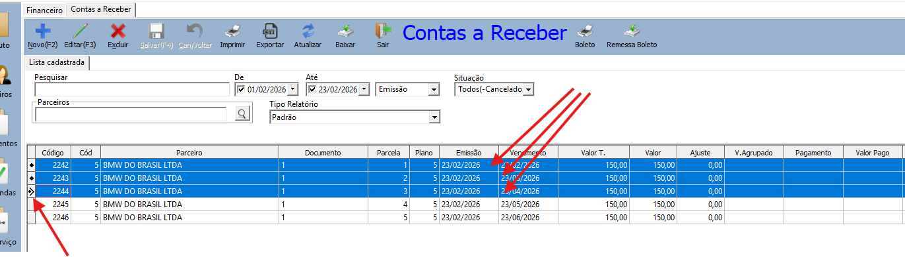
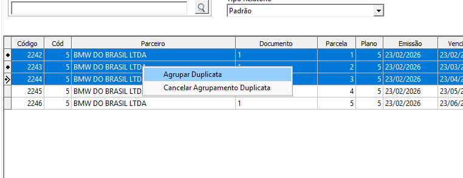
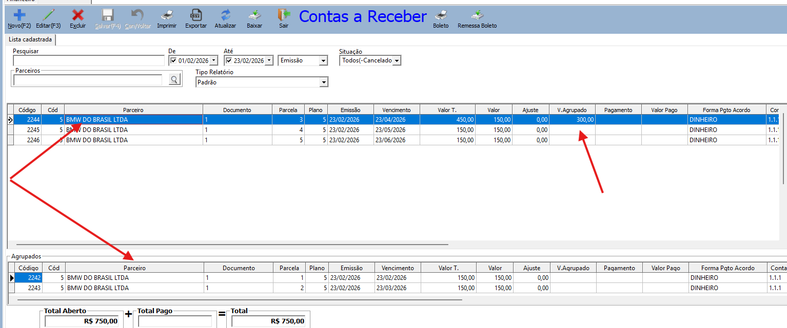

Como agrupar duplicatas

1 – Abrar a consulta de duplicatas a receber e encontre mais de uma duplicata do mesmo cliente, que esteja em aberto sem boleto e que não esteja agrupado.

2 – Aperte Ctrl e clique em cada duplicata, ela ficaram selecionadas igual a tela abaixo:

4 – Clique com o direito do mouse, e selecione a opção Agrupar.

