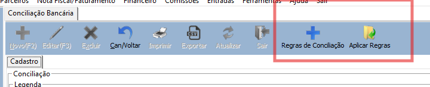
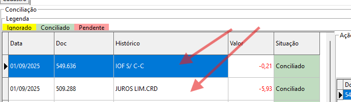
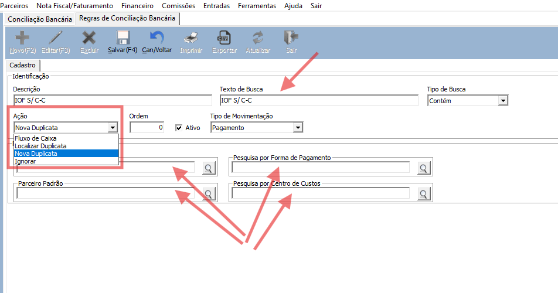

# Regras de Conciliação

As regras de conciliação permitem automatizar a classificação de transações do extrato OFX importado no sistema, associando lançamentos bancários a ações do financeiro sem intervenção manual.

**Fonte:** `fontes/Financeiro/uCadRegraConciliacao.pas`  
**Permissão:** código `17`, módulo Financeiro

---

## Como acessar

**Financeiro → Conciliação Bancária → botão "Regras de Conciliação"** na toolbar



---

## Fluxo de uso

### 1. Copiar o histórico do extrato

Na tela de Conciliação Bancária, selecione o item pendente no grid e copie o texto da coluna **Histórico** (`Ctrl+C`). Use esse texto como **Texto de Busca** na regra para garantir que ela bata com precisão.



### 2. Criar uma nova regra

Clique em **Novo (F2)** e preencha:



| Campo | Descrição |
|-------|-----------|
| **Descrição** | Nome interno da regra (obrigatório) |
| **Texto de Busca** | Texto comparado com o histórico OFX (obrigatório) |
| **Tipo de Busca** | Como comparar o texto |
| **Ação** | O que fazer quando a regra bater |
| **Tipo de Movimentação** | Débito, crédito ou ambos |
| **Ordem** | Prioridade — menor número = maior prioridade |
| **Ativo** | Desmarque para suspender a regra sem excluir |

!!! tip "Padrões ao criar nova regra"
    Tipo de Busca = **Contém**, Tipo de Movimentação = **Ambos**, Ativo = marcado.

### 3. Preencher os parâmetros da ação

Os campos do grupo **Parâmetros** mudam conforme a **Ação** selecionada (ver [Visibilidade de campos](#visibilidade-de-campos)).

### 4. Aplicar as regras

Salve a regra, volte para a Conciliação Bancária e clique em **"Aplicar Regras"**. O sistema percorre todos os itens com situação **Pendente** e aplica a primeira regra que bater em cada um. Ao final, exibe um resumo com o total conciliado.

!!! info
    O botão **Aplicar Regras** só fica habilitado quando há um item OFX selecionado na tela.

---

## Tipo de Busca

Define como o **Texto de Busca** é comparado com o histórico OFX (sem distinção de maiúsculas/minúsculas):

| Opção | Comportamento |
|-------|---------------|
| **Total** | Histórico deve ser igual ao texto |
| **Inicia com** | Histórico começa com o texto |
| **Contém** | Histórico contém o texto em qualquer posição |
| **Termina com** | Histórico termina com o texto |

---

## Ações disponíveis

### Fluxo de Caixa
Cria um lançamento direto no Fluxo de Caixa vinculado ao item OFX, sem gerar duplicata.  
Ideal para: tarifas bancárias, IOF, juros, encargos.

**Parâmetros obrigatórios:** Plano de Contas + Forma de Pagamento.

### Localizar Duplicata
Busca uma duplicata existente (a pagar/receber) que corresponda ao tipo, valor e data do item OFX e a concilia automaticamente.  
Ideal para: pagamentos de duplicatas já cadastradas no sistema.

**Parâmetros:** nenhum.

### Nova Duplicata
Cria uma nova duplicata a partir dos dados do item OFX e em seguida a concilia.  
Ideal para: lançamentos recorrentes que não têm duplicata pré-cadastrada.

**Parâmetros obrigatórios:** Plano de Contas.  
**Parâmetros opcionais:** Forma de Pagamento, Parceiro, Centro de Custo.

### Ignorar
Marca o item OFX como ignorado, sem gerar nenhum lançamento.  
Ideal para: transferências entre contas próprias, estornos, lançamentos irrelevantes.

**Parâmetros:** nenhum.

---

## Tipo de Movimentação

Filtra a regra pelo sentido do lançamento no extrato:

| Opção | Aplica-se a |
|-------|-------------|
| **Ambos** | Qualquer lançamento |
| **Recebimento** | Apenas lançamentos com valor positivo (crédito) |
| **Pagamento** | Apenas lançamentos com valor negativo (débito) |

---

## Visibilidade de campos

Os campos do grupo **Parâmetros** aparecem conforme a Ação selecionada:

| Parâmetro | Fluxo de Caixa | Localizar Dup | Nova Duplicata | Ignorar |
|-----------|:--------------:|:-------------:|:--------------:|:-------:|
| Plano de Contas | ✓ | — | ✓ | — |
| Forma de Pagamento | ✓ | — | ✓ | — |
| Parceiro | — | — | ✓ | — |
| Centro de Custo | — | — | ✓ | — |

---

## Ordem de prioridade

Quando mais de uma regra poderia bater no mesmo lançamento, o campo **Ordem** determina qual é testada primeiro. A **primeira que bater** é a única aplicada — as demais são ignoradas para aquele item.

!!! warning "Atenção com regras genéricas"
    Regras com **Contém** e **Ambos** são muito abrangentes. Coloque-as com **Ordem maior** (menor prioridade) do que regras específicas, ou elas vão "vencer" antes das mais precisas serem testadas.

---

## Validações ao salvar

| Situação | Mensagem exibida |
|----------|-----------------|
| Descrição vazia | "Descrição não preenchida" |
| Texto de Busca vazio | "Histórico (texto de busca) não preenchido" |
| Ação não selecionada | "Ação não selecionada" |
| Fluxo de Caixa ou Nova Dup sem Plano de Contas | "Plano de contas não preenchido" |
| Fluxo de Caixa sem Forma de Pagamento | "Forma de pagamento não preenchida" |
| Tipo de Busca não selecionado | "Tipo de busca não selecionado" |

!!! note
    Para **Nova Duplicata**, a Forma de Pagamento **não** é validada. Se não informada, o sistema pode solicitar ao usuário no momento da conciliação.

---

??? note "Referência técnica"

    ### Constantes (`uCadRegraConciliacao.pas`)

    ```pascal
    // Ações (RCON_LANCAMENTO)
    RCON_LANC_FLUXO_CAIXA   = 1;
    RCON_LANC_LOCALIZAR_DUP = 2;
    RCON_LANC_NOVA_DUP      = 3;
    RCON_LANC_IGNORAR       = 4;

    // Tipos de busca (RCON_TIPO)
    RCON_TIPO_TOTAL   = 1;
    RCON_TIPO_INICIA  = 2;
    RCON_TIPO_CONTEM  = 3;
    RCON_TIPO_TERMINA = 4;
    ```

    ### Tabela `REGRA_CONCILIACAO`

    | Campo | Tipo | Descrição |
    |-------|------|-----------|
    | `RCON_CODIGO` | INTEGER PK | Gerado por `GEN_REGRA_CONCILIACAO_ID` |
    | `RCON_DESCRICAO` | VARCHAR(80) | Nome da regra |
    | `RCON_HISTORICO` | VARCHAR(200) | Texto de busca |
    | `RCON_TIPO` | INTEGER | 1=Total, 2=Inicia, 3=Contém, 4=Termina |
    | `RCON_LANCAMENTO` | INTEGER | 1=Fluxo Caixa, 2=Localizar Dup, 3=Nova Dup, 4=Ignorar |
    | `RCON_TIPO_MOV` | CHAR(1) | 'A'=Ambos, 'R'=Recebimento, 'P'=Pagamento |
    | `RCON_ORDEM` | INTEGER | Prioridade (menor = primeiro testado) |
    | `RCON_ATIVO` | CHAR(1) | 'S'=ativo, 'N'=inativo |
    | `PLC_CODIGO_LANCAMENTO` | INTEGER FK | Plano de Contas |
    | `FPG_CODIGO` | INTEGER FK | Forma de Pagamento |
    | `PES_CODIGO` | INTEGER FK | Parceiro padrão |
    | `CNC_CODIGO` | INTEGER FK | Centro de Custo |
