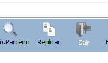
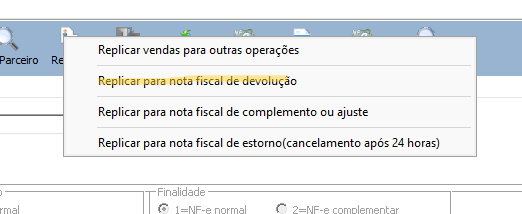
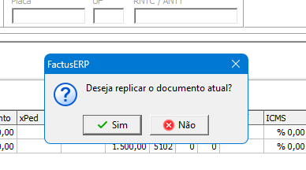
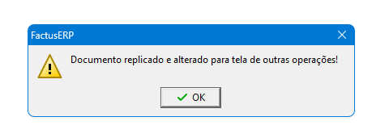
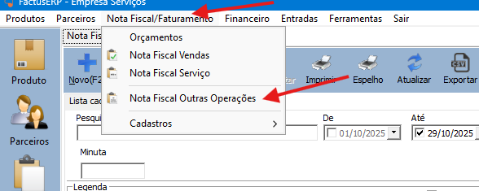
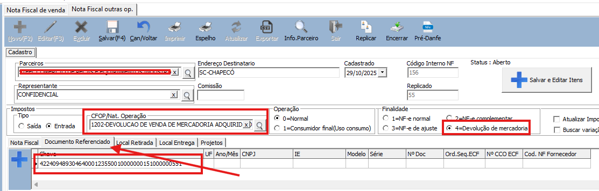

Como gerar uma nota fiscal de devolução da nota fiscal de vendas ou nf outras operações

1 – Na nota fiscal que deseja gerar a devolução, clique com o direito do mouse no botão “Replicar”

2 – Escolha a opção, “Replicar para nota fiscal de devolução” (Ou escolha a opção desejada)

Selecione sim para replicar o documento

3 –  No menu Nota fiscal/Faturamento, escolha a opção Nota fiscal Outras operações, localize e abra o novo documento.

4 – No novo documento, será replicado, já com CFOP de Devolução, Finalidade 4 – Devolução e no documento referenciado, vai estar informado a chave da Nfe devolvida.

Agora deve revisar os dados, seguir nova orientação da contabilidade e realizar o faturamento padrão do sistema para autorizar a nota fiscal.