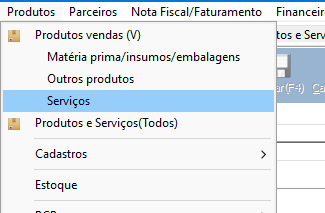
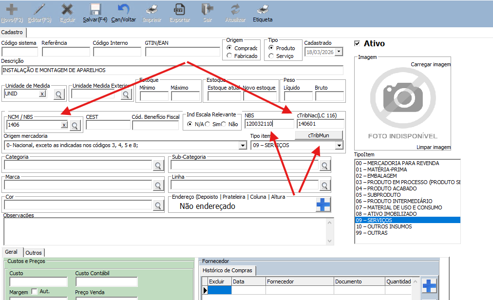
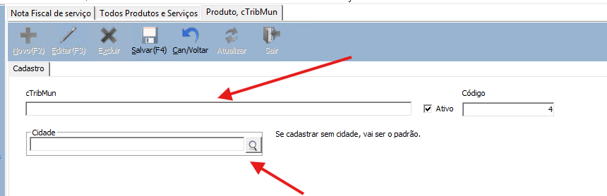
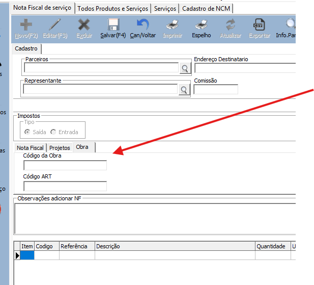
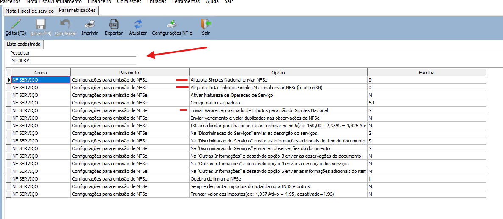
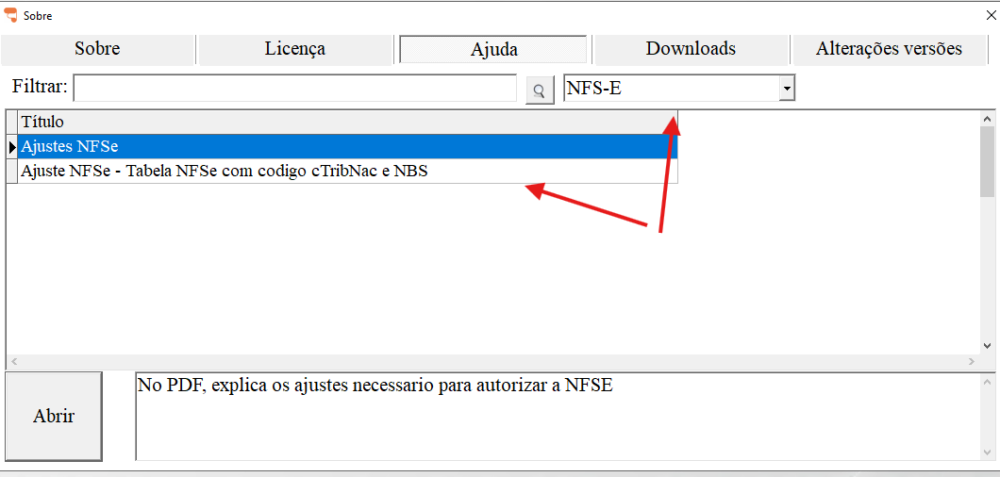
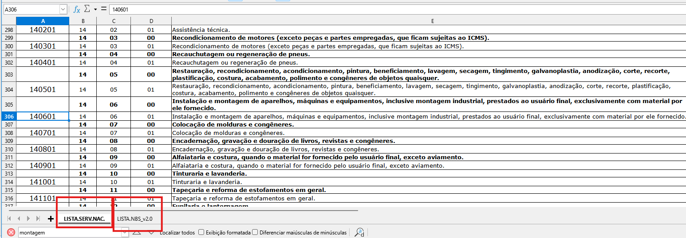
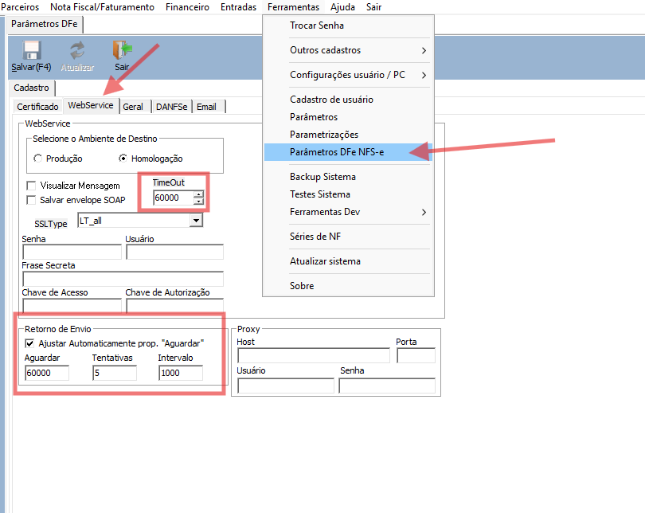
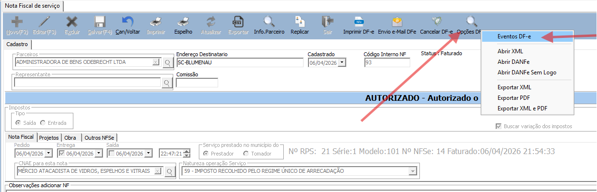
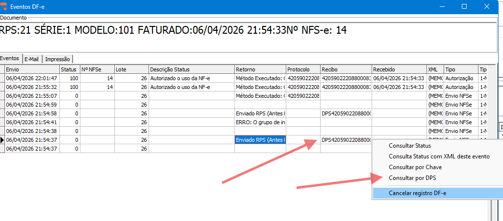

Configuração para mudanças NFSe

1 – Atualizar sistema para 26.01.04.01 ou superior.

2.1 O Sistema utilizava o NCM/NBS no envio da NFSe, mas com a nova NFSe, teve mudanças na tabela:

1º Foi criado o novo campo cTribNac(LC 116), preencher buscando o valor na planilha.

2º NBS com 9 digitos, buscar na também na planilha.

Também foi adicionado no nota fiscal os campos para informar Código da Obra e Código ART.

Se nota já faturado, e der rejeição, clicando em Encerrar pode ser informado esses códigos.

Em parametrizações 3 configurações listado abaixo.

Documentação do governo.

https://www.gov.br/nfse/pt-br/biblioteca/documentacao-tecnica/documentacao-atual

No ajuda do sistema, temos a opção de baixar a planilha

Na parte inferior temos a tabela cTribNac e NBS

Caso tenha erro de Timeout mudar as configurações abaixo:

Na linha com o código DPS, com o direito do mouse, clique em Consulta por DPS para buscar a autorização do documento, ou se não existir, utilize Consultar por Chave ou DPS, informe o código para buscar o retorno.

