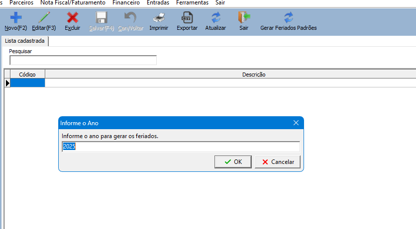
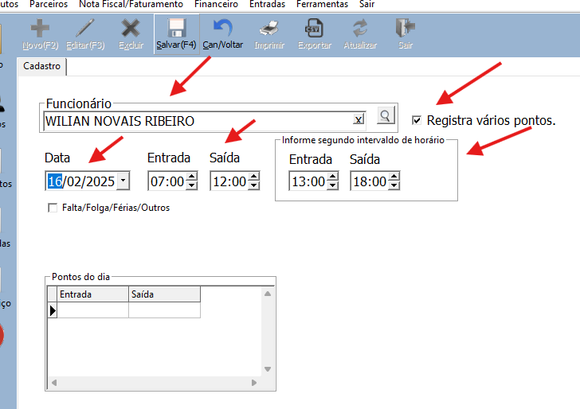
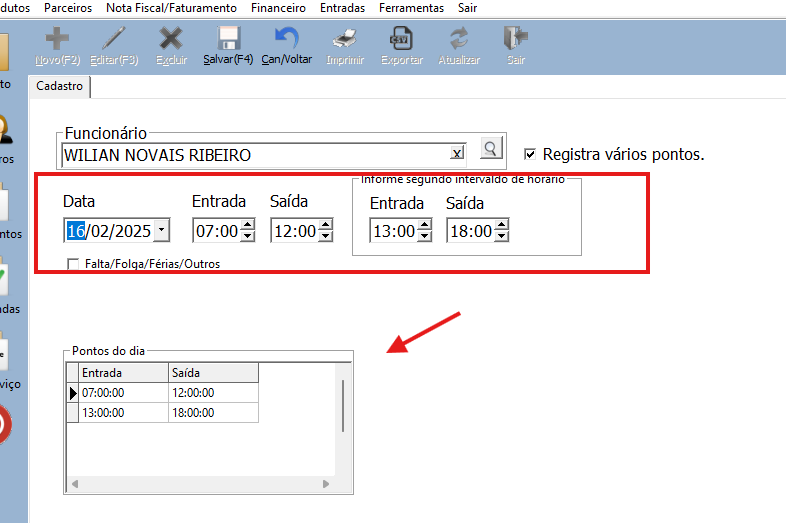
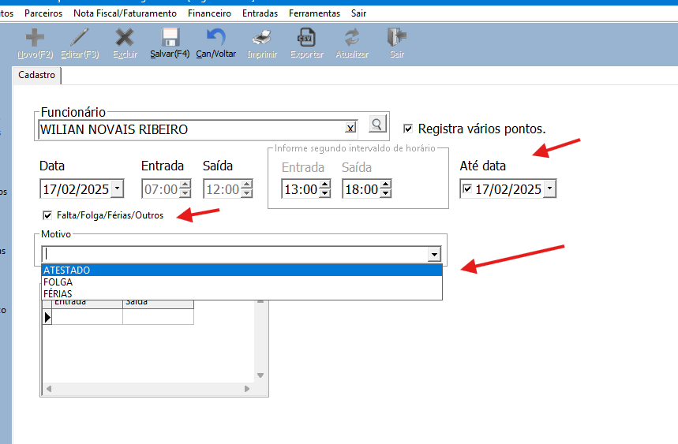
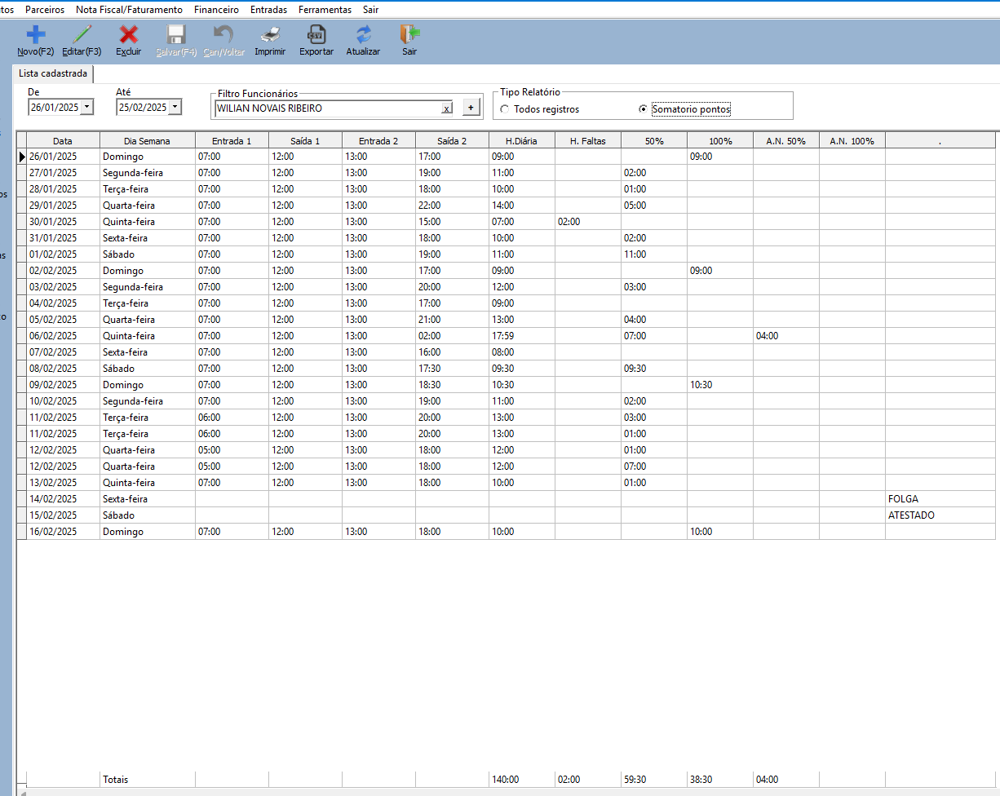
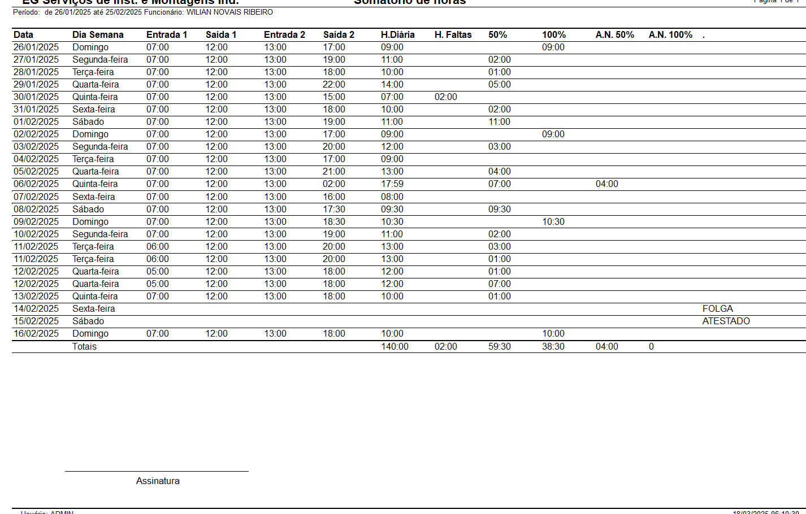

Como registrar pontos e gerar relatório.

Verificar feriados cadastrados.

Menu: Ferramentas → Outros cadastros → Feriados.

Clique no botão Gerar Feriados Padrões, informe o ano e clique em sim.

Registrar ponto

No menu: Parceiros → Registro Ponto.

O Sistema vai carregar o período padrão não encerrado, informe um funcionário e clique em novo.

Na próxima tela, marque a opção Registra vários pontos, informe a data, hora entrada 1, hora entrada 2, já pode informar o segundo período informando a entrada 1 e 2 e clique em Salvar ou F4.

Ajuste a data e informe os horários do próximo dia, execute essa opção até realizar todos os lançamentos.

Para lançar dias de atestado, férias, outros.

Marque a opção “Faltas/Folga/Férias/Outros”, escolha o motivo, se for mais dias na sequencia, marque a segunda data “Até data” e salve.

Após realizar todos os laçamentos, pode ser emitido o relatório do período por funcionário.

Preenchendo um funcionário, marcando a opção Somatório de Pontos.

